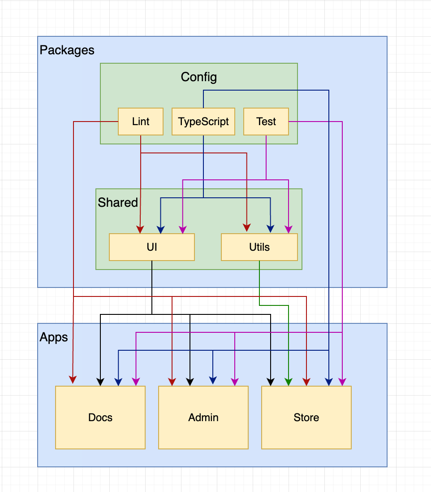

# Monorepo with Turborepo example.

This repository is an example of a monorepo with packages that are shared with apps and shared tasks (scripts) leveraging Turborepo's
cache for significant DX improvements.

The Monorepo consists of the following structure

- packages
  - config
    - lint — EsLint
    - Test — ViTest (base, node, ui)
    - TypeScript (base, nextjs, react-library)
  - shared
    - UI — React component library
    - Utils — Common utilities
- apps
  - docs — Storybook documentation of component library
  - admin — NextJS Application
  - store - NextJS Application

The diagram below highlights the structure and the relationships between the packages.

